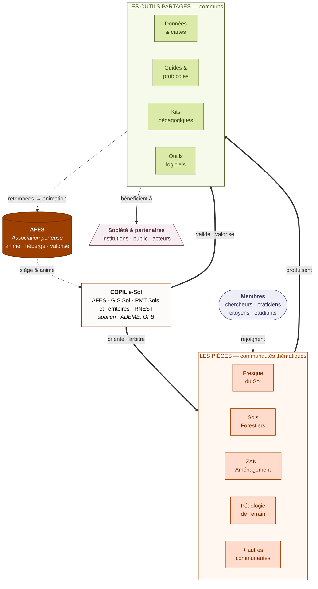
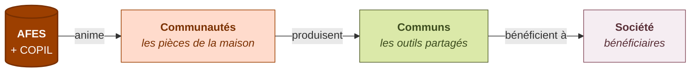

# Schéma de gouvernance e-Sol

Diagramme Mermaid versionnable du fonctionnement institutionnel d'e-Sol.
Source de vérité : [Charte e-sol.fr](https://e-sol.fr/?Charte).

## Vue d'ensemble

## Lecture du schéma

- **AFES** est l'**association porteuse**. Elle anime le réseau et l'héberge techniquement, mais ne possède ni les communautés ni les communs.
- Le **COPIL e-Sol** est l'instance multi-acteurs qui oriente le réseau : AFES + GIS Sol + RMT Sols et Territoires + RNEST, avec le soutien de l'ADEME et de l'OFB.
- Les **membres** rejoignent une ou plusieurs **pièces** (communautés thématiques).
- Les **pièces produisent des outils partagés** (communs) : données, guides, kits, logiciels.
- Les **communs bénéficient à la société et aux partenaires** (intérêt général).
- Les **retombées de la valorisation** des communs alimentent l'animation (cycle vertueux).

## Variante simplifiée (3 niveaux)

À utiliser en page d'accueil YesWiki ou en pied de mail d'accueil — plus accessible que la version complète.

## Export PNG / SVG pour le wiki

YesWiki ne rend pas Mermaid nativement. Pour publier ce schéma sur [e-sol.fr](https://e-sol.fr) :

1. Coller le bloc Mermaid dans [mermaid.live](https://mermaid.live).
2. Exporter en **PNG** (largeur ~1200px) ou **SVG**.
3. Déposer dans `src/img/maison/` (versions repo) et téléverser sur la page wiki cible (`?MaisonESol` ou `?Gouvernance`).
4. Garder ce fichier `.md` comme source éditable — tout changement de gouvernance se reflète ici en premier.

## À mettre à jour quand…

- Une nouvelle communauté significative est lancée (ajouter dans le subgraph PIECES si pertinent).
- La composition du COPIL change (entrée/sortie d'un partenaire).
- La typologie des communs évolue (cf. phase 4 du plan : cycle de vie).
- Les modalités de retombées économiques changent dans la Charte.
