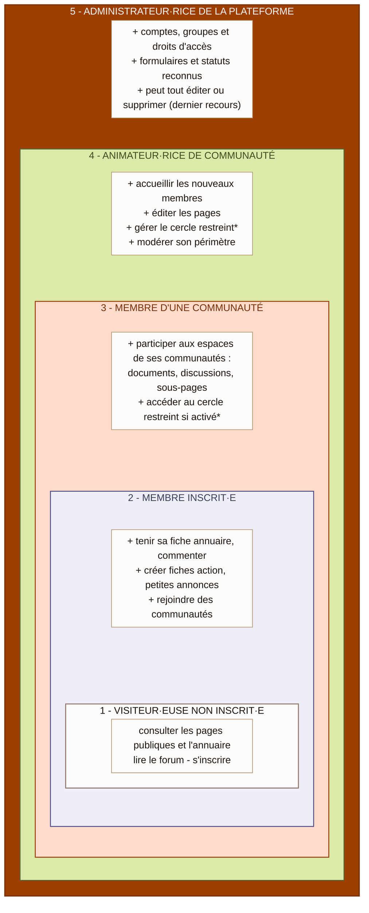
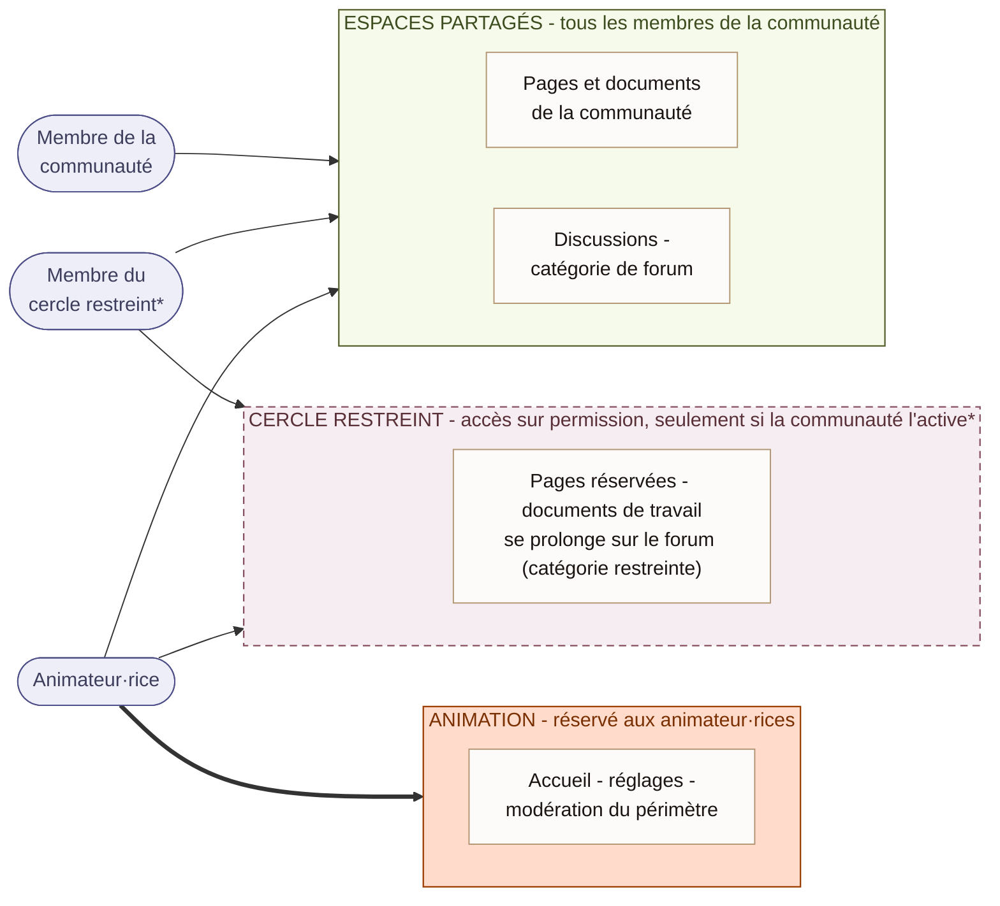
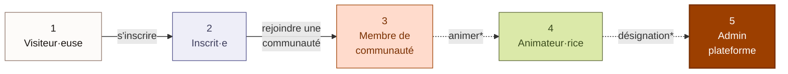

# Schéma des rôles et droits e-Sol

Diagrammes Mermaid versionnables des rôles et droits de la plateforme.
Source de vérité : [docs/roles-et-droits.md](../../docs/roles-et-droits.md) (référentiel établi le 30/07/2026,
statut « proposition, à valider »). Les points marqués `*` dans les schémas portent la même
mention « proposition, à valider » que dans le référentiel.

## Vue générale : les cinq niveaux plateforme

Les niveaux sont **cumulatifs** : chaque cadre contient le précédent, comme des cercles
concentriques. Ce qu'on gagne à un niveau s'ajoute à tout ce qu'on avait déjà.

## Lecture du schéma

- **L'emboîtement dit tout** : un·e animateur·rice (4) reste membre de ses communautés (3),
  inscrit·e (2) et visiteur·euse (1). Aucun niveau ne retire de droits.
- **Comment on monte d'un niveau** : 1 vers 2 par le formulaire d'inscription (gratuit,
  immédiat) ; 2 vers 3 librement, en se rattachant à la communauté depuis l'inscription,
  sa page ou sa fiche annuaire (l'équipe d'animation est notifiée à l'arrivée) ; 3 vers 4
  par désignation au sein de la communauté (cadre à préciser*) ; 4 vers 5 par ajout au
  groupe `@admins` (proposition : décision AFES / COPIL*).
- `*` **proposition, à valider** : mention identique dans le référentiel
  (cercle restreint paramétrable, cadre du rôle d'animation, attribution du rôle admin).
- **Limite technique actuelle** : le rattachement à une communauté est déclaratif par
  choix (adhésion libre, décision d'août 2026), mais cocher une communauté n'alimente
  aujourd'hui aucun groupe d'utilisateurs. Les droits réels par communauté, cercle
  restreint en tête, supposent des groupes YesWiki dédiés (référentiel, sections 4.6 et 4.7).

## Vue communauté : la granularité interne

Au sein d'une communauté, trois positions : membre, membre du cercle restreint (si la
communauté l'active), animateur·rice. Ce schéma est un **support de décision** pour
l'équipe d'animation : il permet de dire « nous, on active / on n'active pas le cercle
restreint ».

**Lecture** :

- Les trois cadres représentent l'intérieur d'une **même communauté** ; les trois profils
  à gauche sont ses membres. Une flèche = « a accès à ».
- Le **cadre en pointillés** signale un espace optionnel : le cercle restreint est un outil
  à activer, pas une règle imposée*. Une communauté sans cercle restreint est parfaitement
  valable (deux positions seulement : membre, animateur·rice). On entre dans le cercle sur
  permission de l'équipe d'animation, sur la plateforme comme sur le forum (catégorie
  restreinte).
- L'entrée dans une communauté, elle, est libre partout (décision d'août 2026). Chaque
  communauté arbitre **deux curseurs** : cercle restreint (activé ou non), écriture des
  pages (animateur·rices seulement ou tout le groupe). Détail et réglages YesWiki
  correspondants : référentiel, section 2.
- Techniquement, ces choix se traduisent en **groupes et ACL natifs** ; leur exécution
  passe aujourd'hui par un·e admin de la plateforme (la gestion des groupes est réservée
  aux admins, référentiel 4.7).

## Variante simplifiée (parcours de participation)

À utiliser en page d'accueil ou dans un mail d'accueil : le parcours plutôt que
l'emboîtement. Les flèches en pointillés signalent les passages dont le cadre reste à
préciser*.

## Export PNG pour le wiki

YesWiki ne rend pas Mermaid nativement. Pour publier ces schémas sur [e-sol.fr](https://e-sol.fr) :

1. `node build.js` puis `node scripts/capture-village.js` : la vue communauté est rendue
   localement (mêmes bibliothèque, thème et polices que la démo) et exportée en
   `src/img/portage/roles-vue-communaute.png` (~1200 px de large). L'infographie compagne
   `src/components/illustration-roles.html` (le sentier) est exportée par la même commande en
   `src/img/portage/roles-cinq-niveaux.png`. Repli manuel : mermaid.live (procédure au § 2.2
   de `docs/00-portage-README.md`).
2. Téléverser sur la page wiki cible (proposition : `?RolesEtDroits`, nom à valider).
3. Garder ce fichier `.md` comme source éditable : tout changement de droits se répercute
   d'abord dans `docs/roles-et-droits.md`, puis ici, puis dans les exports.

## À mettre à jour quand…

- Le référentiel `docs/roles-et-droits.md` évolue (validations de Lucile, réponses de
  Laurent) : c'est lui la source, les schémas suivent.
- Les points marqués `*` sont tranchés : retirer la mention et figer le libellé
  (cercle restreint, cadre du rôle d'animation, attribution du rôle admin).
- Le vocabulaire du rôle d'animation est arbitré (animateur·rice / référent·e /
  coordinateur·rice) : harmoniser tous les libellés.
- Les groupes par communauté sont branchés sur le formulaire d'inscription (le niveau 3
  cesse d'être purement déclaratif).
- La liste des statuts reconnus change (ajouts « porteur de projet SRP Sol » et
  « référent Soléar » notamment) : vérifier si un schéma doit les mentionner.
